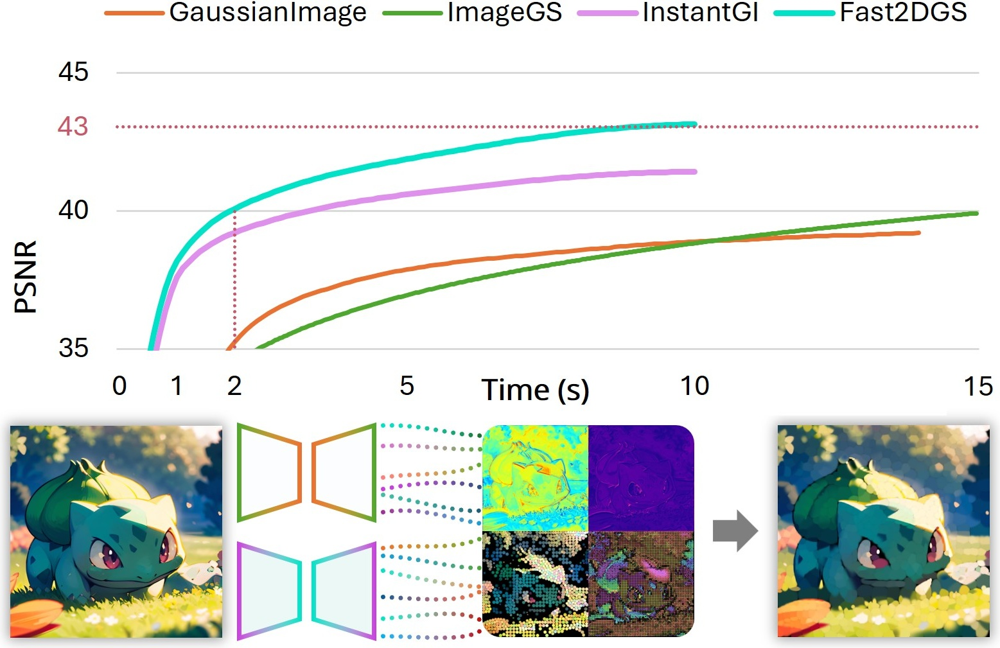
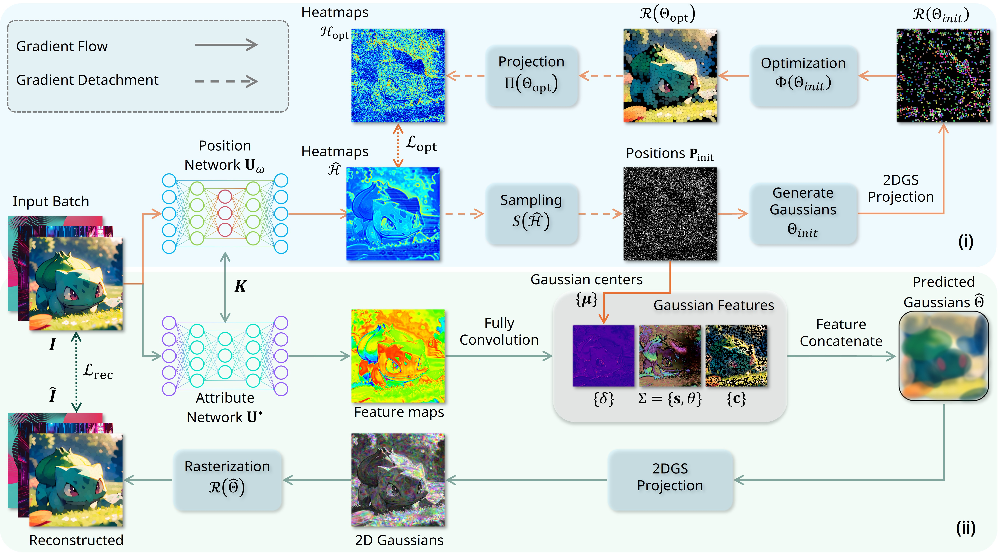
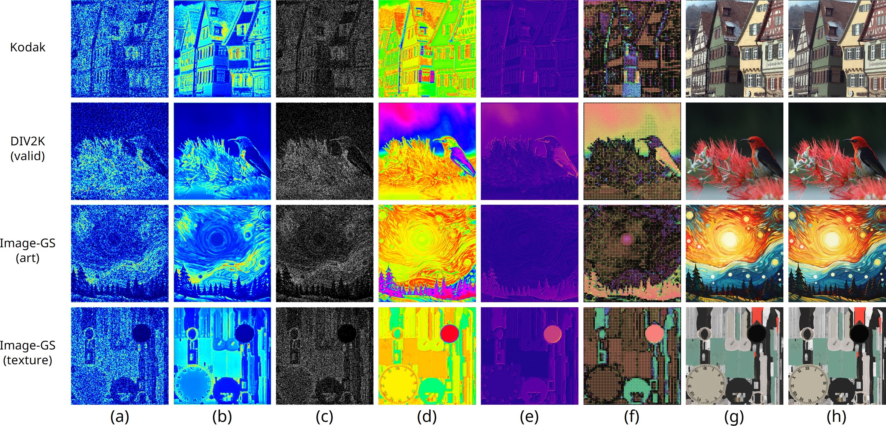
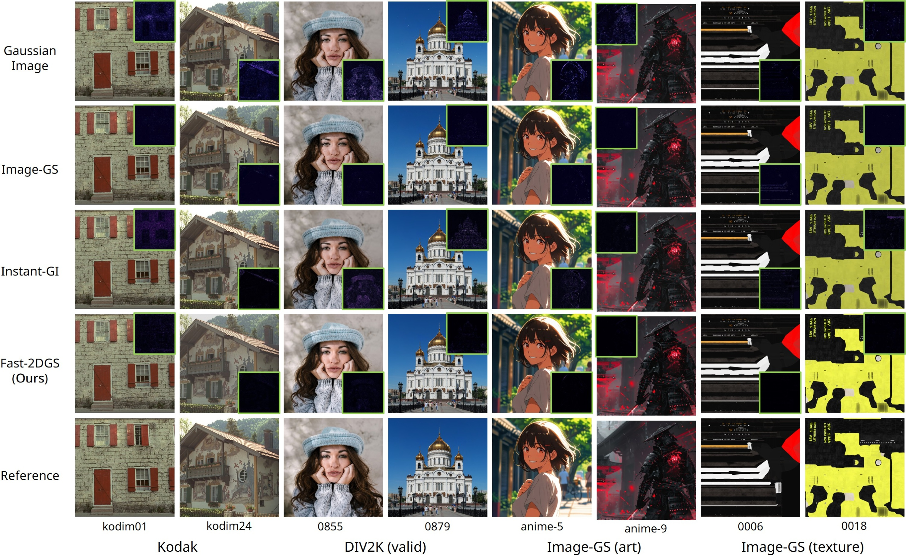
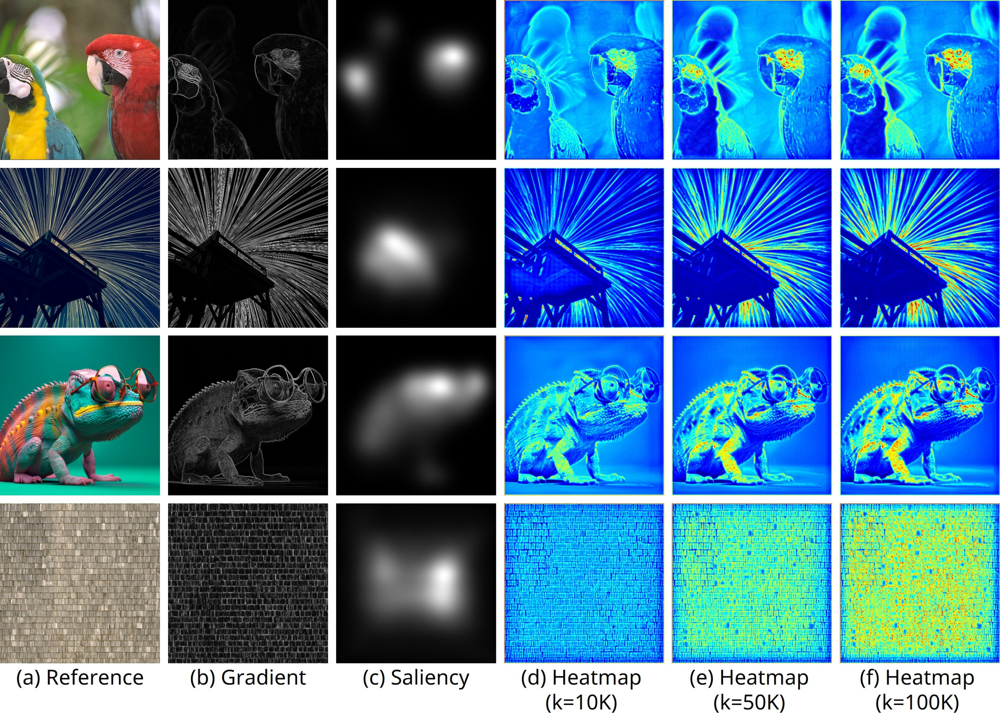
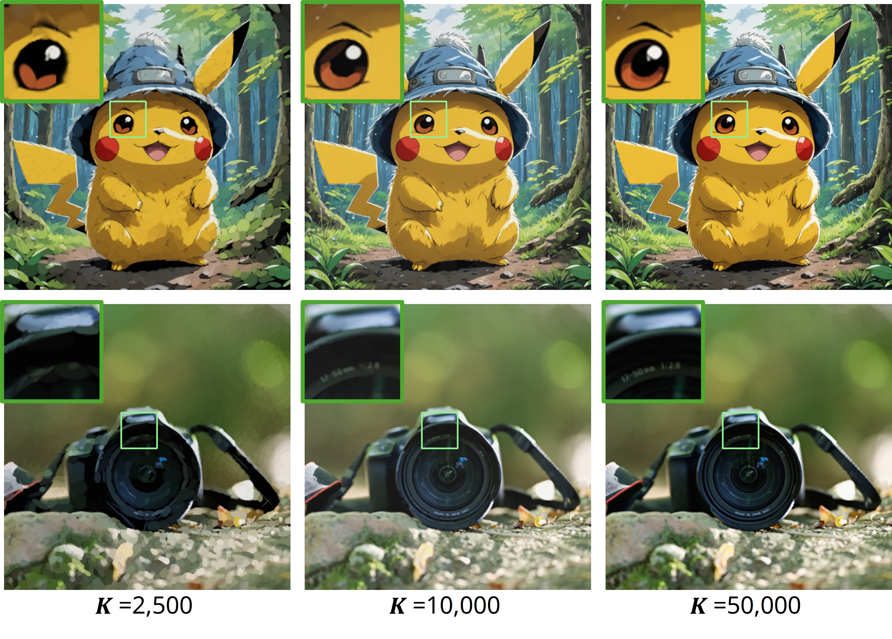
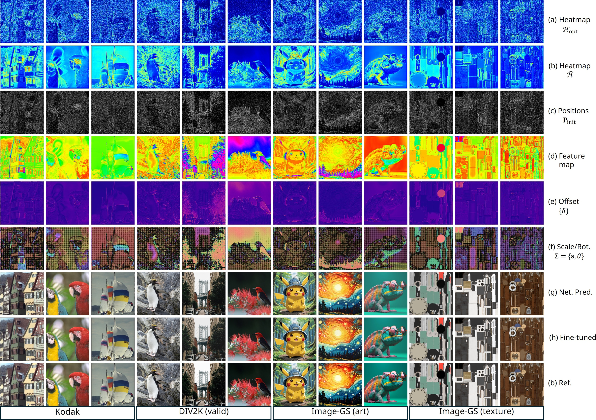

# Fast 2DGS: Efficient Image Representation with Deep Gaussian Prior

As generative models become increasingly capable of producing high-fidelity visual content, the demand for efficient, interpretable, and editable image representations has grown substantially. 
Recent advances in 2D Gaussian Splatting (2DGS) have emerged as a promising solution, offering explicit control, high interpretability, and real-time rendering capabilities ($>1000$ FPS). 
However, high-quality 2DGS typically requires post-optimization. Existing methods adopt random or heuristics (e.g., gradient maps), which are often insensitive to image complexity and lead to slow convergence ($>10s$). More recent approaches introduce learnable networks to predict initial Gaussian configurations, but at the cost of increased computational and architectural complexity.
To bridge this gap, we present \textbf{Fast-2DGS}, a lightweight framework for efficient Gaussian image representation. Specifically, we introduce Deep Gaussian Prior, implemented as a conditional network to capture the spatial distribution of Gaussian primitives under different complexities. In addition, we propose an attribute regression network to predict dense Gaussian properties.
Experiments demonstrate that this disentangled architecture achieves high-quality reconstruction in a single forward pass, followed by minimal fine-tuning. More importantly, our approach significantly reduces computational cost without compromising visual quality, bringing 2DGS closer to industry-ready deployment.

(will update more)

<p align="center">
    
</p>

## Setup
1. Navigate to projekt folder, Create a new Python environment and install the dependencies (double check CUDA path). We use ```torch==2.7.1+cu126``` for this study, since torch==2.9 found very slow on gsplat.
    ```bash
    conda create -n 2dgs python=3.12
    conda activate 2dgs
    pip install -r requirements.txt
    git clone https://github.com/Aztech-Lab/gmod.git
    cd gmod
    pip install -e . --no-build-isolation
    cd ..
    ```
*Note: You might encounter CUDA path issue when install ```gmod```, set CUDA path to match your torch version, then install ```gmod``` again.
*The ```gmod``` package is build by [Image-GS](https://github.com/NYU-ICL/image-gs) team. We rename it to ```gmod``` to aviod conflict with other ```gsplat``` library.

Now you can run ```python 2dgs_test.py``` for a simple demo of 2DGS on Bulbasaur, results are saved in ```./test/fit_outputs```.

2. Clone the datasets from [2DGS_dataset](https://github.com/Aztech-Lab/2DGS_dataset), download [DIV2K_train_HR](https://data.vision.ee.ethz.ch/cvl/DIV2K/) and organize the folder structure as follows:
    ```bash
    git clone https://github.com/Aztech-Lab/2DGS_dataset.git
    ```

    ```
    2DGS_dataset
    └── dataset
        ├── Kodak
        └── DIV2K
            └── DIV2K_train_HR (need to download)
            └── DIV2K_valid_HR
        └── ImageGS_anime
        └── ImageGS_textures
    ```

(will update soon)


## Framework

<p align="center">
    
</p>


## Results

<p align="center">
    
</p>

<p align="center">
    
</p>


## Gaussian Initialization Comparison

<p align="center">
    
</p>


## Impact of Gaussians 

<p align="center">
    
</p>


## Additional Results


<p align="center">
    
</p>


## Acknowledgements
We sincerely appreciate the [Image-GS](https://github.com/NYU-ICL/image-gs) team for providing the 2DGS rendering core and for sharing their high-quality datasets, and we thank [Instant-GI](https://github.com/whoiszzj/Instant-GI) team for their great work and deep inspiration. Moreover, we thank the [GaussianImage](https://github.com/Xinjie-Q/GaussianImage) team for their foundation work at this domain.

## Citation
If you find this project helpful to your research, please consider citing [BibTeX](assets/docs/image-gs.bib):
```bibtex
@article{wang2025fast,
  title={Fast 2DGS: Efficient Image Representation with Deep Gaussian Prior},
  author={Wang, Hao and Bastola, Ashish and Zhou, Chaoyi and Zhu, Wenhui and Chen, Xiwen and Dong, Xuanzhao and Huang, Siyu and Razi, Abolfazl},
  journal={arXiv preprint arXiv:2512.12774},
  year={2025}
}
```
