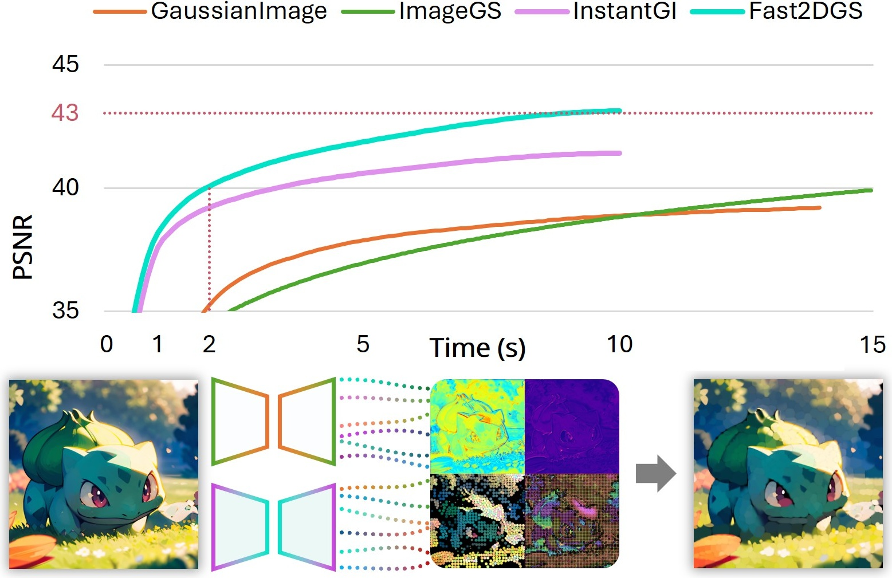
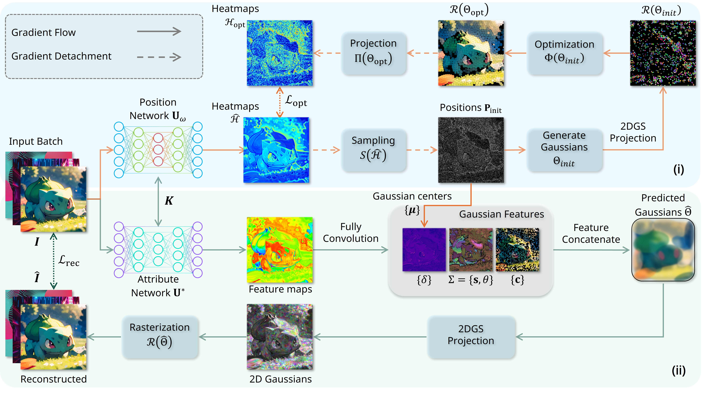
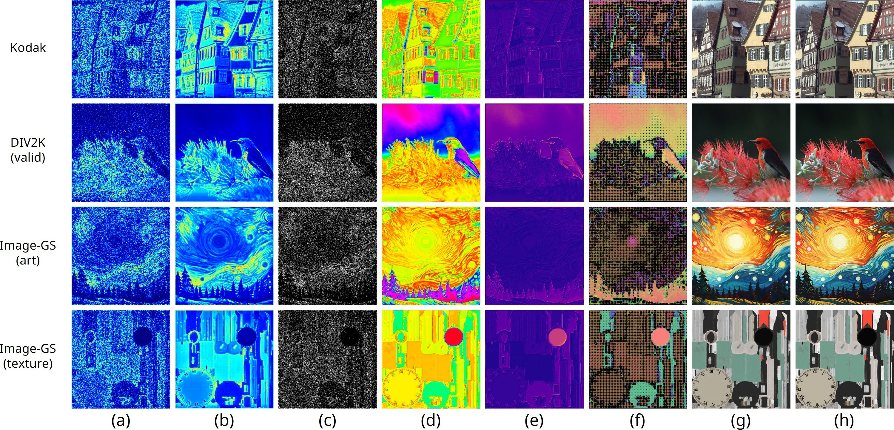
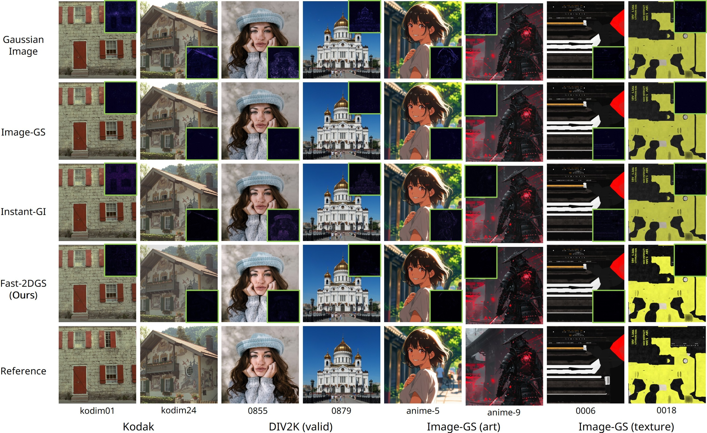
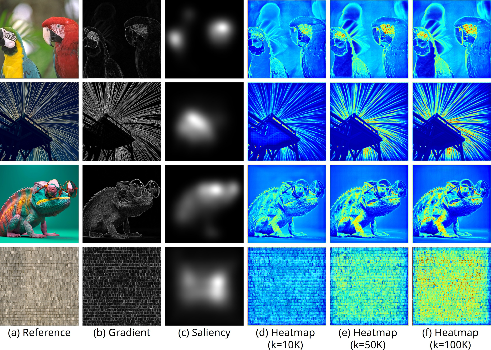
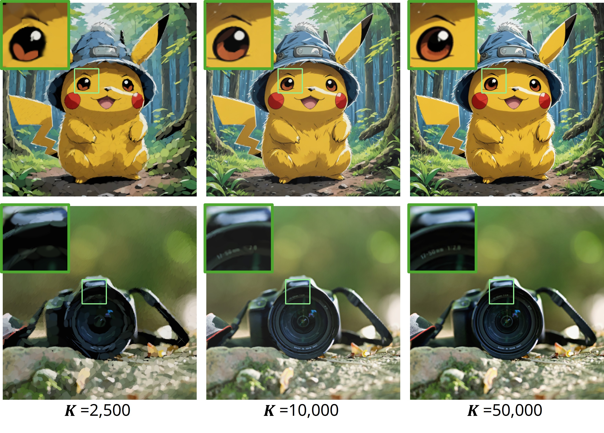
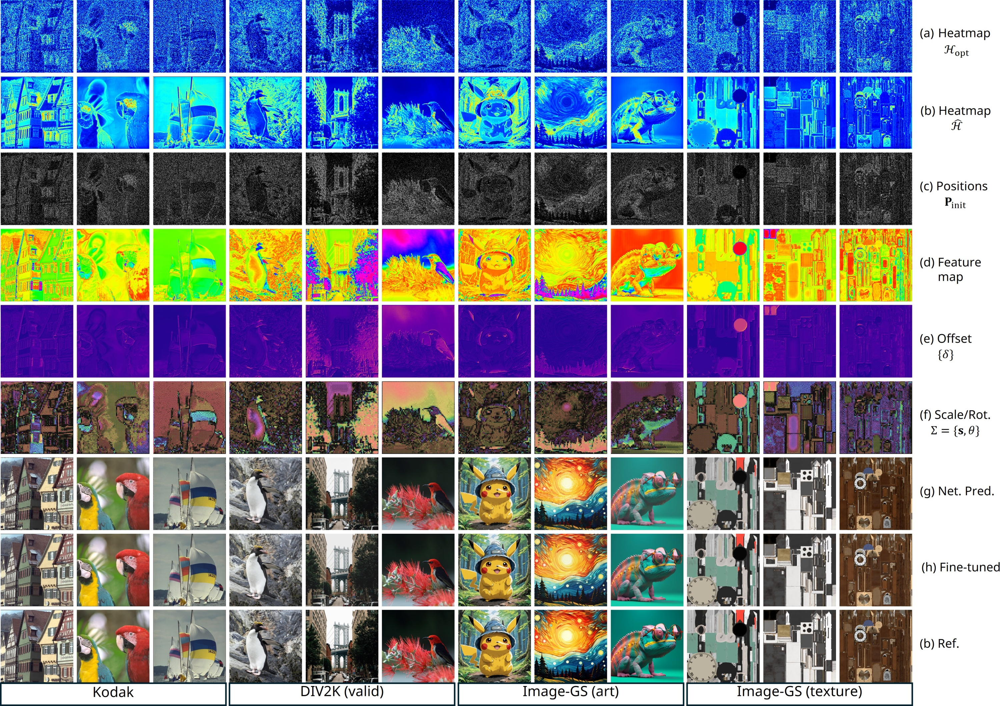

# Fast 2DGS: Efficient Image Representation with Deep Gaussian Prior

As generative models become increasingly capable of producing high-fidelity visual content, the demand for efficient, interpretable, and editable image representations has grown substantially. Recent advances in 2D Gaussian Splatting (2DGS) have emerged as a promising solution, offering explicit control, high interpretability, and real-time rendering capabilities (>1000 FPS). However, high-quality 2DGS typically requires post-optimization. Existing methods adopt random or heuristics (e.g., gradient maps), which are often insensitive to image complexity and lead to slow convergence (>10s). More recent approaches introduce learnable networks to predict initial Gaussian configurations, but at the cost of increased computational and architectural complexity.

To bridge this gap, we present **Fast-2DGS**, a lightweight framework for efficient Gaussian image representation. Specifically, we introduce Deep Gaussian Prior, implemented as a conditional network to capture the spatial distribution of Gaussian primitives under different complexities. In addition, we propose an attribute regression network to predict dense Gaussian properties. Experiments demonstrate that this disentangled architecture achieves high-quality reconstruction in a single forward pass, followed by minimal fine-tuning. More importantly, our approach significantly reduces computational cost without compromising visual quality, bringing 2DGS closer to industry-ready deployment.

<p align="center">
    
</p>

## Requirements

- Linux / Windows, NVIDIA GPU
- CUDA 12.6+ (matches `torch==2.7.1+cu126`)
- Python 3.10+
- C++ compiler + CUDA toolkit (to build `gmod` — Image-GS 2D rasterizer, renamed to avoid `gsplat` conflicts)

## Installation

```bash
git clone https://github.com/Aztech-Lab/Fast-2DGS.git
cd Fast-2DGS

conda create -n 2dgs python=3.12 -y
conda activate 2dgs
pip install -r requirements.txt

# Install CUDA renderer (one-time)
# Windows:
powershell -ExecutionPolicy Bypass -File scripts/setup_gmod.ps1
# Linux:
bash scripts/setup_gmod.sh

python scripts/check_env.py
```

NOTE: We use the CUDA rasterizer from [Image-GS](https://github.com/NYU-ICL/image-gs), which is heavily optimized for 2DGS and is significantly different than classical [gsplat](https://github.com/nerfstudio-project/gsplat) (e.g., GaussianImage). To avoid conflicts, we rename it as [gmod](https://github.com/Aztech-Lab/gmod.git).

If install fails, ensure `nvcc` / CUDA path matches your PyTorch CUDA version (ours: `torch==2.7.1+cu126`).

## Project Layout

```
Fast-2DGS/
├── engine.py              # Core API: encode / sample / rasterize / tune
├── inference.py           # CLI inference + batch runs
├── main_demo.py           # Inference quick start (recommended first run)
├── main_train_heat.py     # Stage 1 training quick start
├── main_train_feat.py     # Stage 2 training quick start
├── main_benchmark.py      # Paper-aligned dataset benchmark
├── benchmark.py           # Benchmark core (metrics + aggregation)
├── train_heatmap.py       # Stage 1: train HeatmapUNet (full script)
├── train_feature.py       # Stage 2: train GaussianUNet_Plus (full script)
├── tools.py               # Logging, heatmap, training helpers
├── dataset.py             # Image loader (center-crop by default)
├── models/GS_UNet.py      # HeatmapUNet, GaussianUNet, GaussianUNet_Plus
├── weights/               # Pretrained checkpoints
├── scripts/               # setup_gmod, check_env
└── old/                   # Archived legacy scripts
```

## Quick Start

### 1. Python API demo (recommended)

```bash
python main_demo.py
```

Prints the API snippet, runs forward + fine-tune on `assets/anime-1_2k.png`, saves to `outputs/demo/`.

### 2. CLI inference

```bash
python inference.py --input assets/anime-1_2k.png --progress
```

Outputs go to `outputs/infer/` (`*_gt.png`, `*_pred_init.png`, `*_pred_tune.png`, `summary.json`).

### 3. Batch inference (lightweight)

```bash
python inference.py --input_dir 2DGS_dataset/dataset/Kodak --progress
```

### 4. Benchmark

```bash
python main_benchmark.py
python main_benchmark.py --data_path 2DGS_dataset/dataset/Kodak --save_grid --progress
```

Reports init/tune PSNR, 1s/2s/5s PSNR, MS-SSIM, inference/tune/batch time, FPS → `outputs/benchmark_kodak/summary.json`.

### Python API

```python
from engine import Fast2DGEngine, load_image

engine = Fast2DGEngine(K=50_000, tune_steps=3000)
imgs = load_image("assets/anime-1_2k.png", image_size=512, crop=True, device=engine.device)

# Option A: step-by-step
pred, heatmap, params = engine.forward(imgs)       # encode -> sample -> rasterize
tune = engine.tune(imgs, params, tune_steps=3000)    # fine-tune

# Option B: one call
imgs, result = engine.run_image("assets/anime-1_2k.png")
print(result.psnr_init, result.psnr_tuned)
```

### Key inference parameters

| Parameter | Default | Description |
|-----------|---------|-------------|
| `--K` | 50000 | Number of Gaussians |
| `--tune_steps` | 3000 | Fine-tuning steps (`0` / `--no_tune` to skip) |
| `--tune_lr` | 2e-3 | AdamW learning rate for fit |
| `--tune_weight_decay` | 0.05 | AdamW weight decay |
| `--no_xy_retain` | False | Random init instead of predicted Gaussians |
| `--image_size` | 512 | Resize shorter side, then center crop |
| `--crop` / `--no-crop` | crop | Center crop (default, keeps aspect ratio) |
| `--feat_plus` | True | Use offset-refined `GaussianUNet_Plus` |
| `--sampling` | multinomial | `multinomial` or `topk` heatmap sampling |
| `--heat_weight` | `weights/smp_heat_div2k.pth` | Heatmap prior checkpoint |
| `--feat_weight` | auto | Attribute network checkpoint |

## Datasets

For training or batch benchmarks, clone [2DGS_dataset](https://github.com/Aztech-Lab/2DGS_dataset) and download [DIV2K](https://data.vision.ee.ethz.ch/cvl/DIV2K/) HR splits:

```bash
git clone https://github.com/Aztech-Lab/2DGS_dataset.git
```

```
2DGS_dataset/
└── dataset/
    ├── Kodak/
    ├── DIV2K/
    │   ├── DIV2K_train_HR/    # 800 images (training)
    │   └── DIV2K_valid_HR/    # 100 images (validation)
    ├── ImageGS_anime/
    └── ImageGS_textures/
```

Point `--data_path` to any image folder. Training and inference use **center crop** by default (resize shorter side to 512, then crop — no aspect-ratio distortion).

## Training

Two-stage pipeline:

```
Stage 1 (heatmap)          Stage 2 (feature)
─────────────────           ─────────────────
HeatmapUNet                 GaussianUNet_Plus (frozen heat)
  ↓ sample K xy               ↓ predict scale/color/rot/offset
  ↓ fit GT Gaussians          ↓ rasterize
  ↓ MSE vs blurred heatmap    ↓ L1+L2 recon loss
```

### Stage 1 — Heatmap prior

```bash
# Quick start (prints API + runs 1-epoch Kodak demo)
python main_train_heat.py

# DIV2K full training
python train_heatmap.py \
  --data_path path/to/DIV2K_train_HR \
  --save_dir exp/heatmap_div2k \
  --init_weight weights/smp_heat_div2k.pth
```

```python
from train_heatmap import build_parser, train

args = build_parser().parse_args([
    "--data_path", "path/to/DIV2K_train_HR",
    "--save_dir", "exp/heatmap_div2k",
    "--num_epochs", "500", "--lr", "5e-4",
])
train(args)
```

| Parameter | Default | Description |
|-----------|---------|-------------|
| `--lr` | 5e-4 | AdamW learning rate |
| `--num_epochs` | 500 | Training epochs |
| `--batch_size` | 8 | Batch size |
| `--k_min` / `--k_max` | 10000 / 100000 | Random K per batch |
| `--gt_steps` | 200 | Inner-loop GT Gaussian fit steps |
| `--init_weight` | (none) | Optional checkpoint to fine-tune from |
| `--crop` | True | Center crop preprocessing |

Outputs in `exp/heatmap*/`: `heat_best.pth`, `heat_last.pth`, `plot_train.png`, `results/epoch_*.png`, `train_log.csv`.

### Stage 2 — Attribute network

```bash
# Quick start (prints API + runs 1-epoch Kodak demo)
python main_train_feat.py

# Full training
python train_feature.py \
  --data_path path/to/DIV2K_train_HR \
  --heat_weight weights/smp_heat_div2k.pth \
  --save_dir exp/feature_div2k
```

```python
from train_feature import build_parser, train

args = build_parser().parse_args([
    "--data_path", "path/to/DIV2K_train_HR",
    "--heat_weight", "weights/smp_heat_div2k.pth",
    "--save_dir", "exp/feature_div2k",
    "--num_epochs", "500", "--lr", "1e-3",
])
train(args)
```

| Parameter | Default | Description |
|-----------|---------|-------------|
| `--heat_weight` | `weights/smp_heat_div2k.pth` | Frozen heatmap checkpoint |
| `--lr` | 1e-3 | AdamW learning rate |
| `--num_epochs` | 500 | Training epochs |
| `--loss_rec` | l1+l2 | Reconstruction loss |
| `--feat_plus` | True | Use `GaussianUNet_Plus` with xy offset |

Outputs in `exp/feature*/`: `feat_best.pth` (best PSNR), `plot_train.png`, `results/epoch_*.png`, `train_log.csv`.

### Pretrained weights

| File | Description |
|------|-------------|
| `weights/smp_heat_div2k.pth` | Heatmap prior (DIV2K fine-tuned) |
| `weights/smp_feat_best_psnr_26_plus.pth` | Feature net with xy offset (default) |
| `weights/smp_feat_best_psnr_26.pth` | Feature net without offset |

## Framework

<p align="center">
    
</p>

## Results

<p align="center">
    
</p>

<p align="center">
    
</p>

## Gaussian Initialization Comparison

<p align="center">
    
</p>

## Impact of Gaussians

<p align="center">
    
</p>

## Additional Results

<p align="center">
    
</p>

## Acknowledgements

We sincerely appreciate the [Image-GS](https://github.com/NYU-ICL/image-gs) team for providing the 2DGS rendering core and for sharing their high-quality datasets, and we thank [Instant-GI](https://github.com/whoiszzj/Instant-GI) team for their great work and deep inspiration. Moreover, we thank the [GaussianImage](https://github.com/Xinjie-Q/GaussianImage) team for their foundation work at this domain.

## Citation

If you find this project helpful to your research, please consider citing:

```bibtex
@article{wang2025fast,
  title={Fast 2DGS: Efficient Image Representation with Deep Gaussian Prior},
  author={Wang, Hao and Bastola, Ashish and Zhou, Chaoyi and Zhu, Wenhui and Chen, Xiwen and Dong, Xuanzhao and Huang, Siyu and Razi, Abolfazl},
  journal={arXiv preprint arXiv:2512.12774},
  year={2025}
}
```